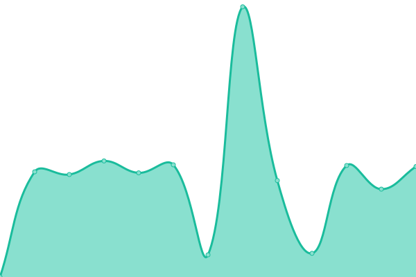
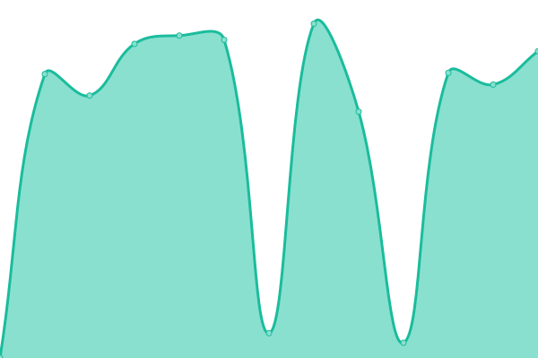
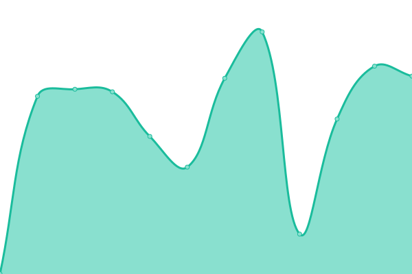

# [📈 Live Status](https://Reishandy.github.io/upptime): <!--live status--> **🟧 Partial outage**

This repository contains the open-source uptime monitor and status page for [Muhammad Akbar Reishandy](https://reishandy.my.id/), powered by [Upptime](https://github.com/upptime/upptime).

With [Upptime](https://upptime.js.org), you can get your own unlimited and free uptime monitor and status page, powered entirely by a GitHub repository. We use [Issues](https://github.com/Reishandy/upptime/issues) as incident reports, [Actions](https://github.com/Reishandy/upptime/actions) as uptime monitors, and [Pages](https://Reishandy.github.io/upptime) for the status page.

<!--start: status pages-->
<!-- This summary is generated by Upptime (https://github.com/upptime/upptime) -->
<!-- Do not edit this manually, your changes will be overwritten -->
<!-- prettier-ignore -->
| URL | Status | History | Response Time | Uptime |
| --- | ------ | ------- | ------------- | ------ |
|  [Reishandy - reishandy.id](https://reishandy.id) | 🟥 Down | [reishandy-reishandy-id.yml](https://github.com/Reishandy/upptime/commits/HEAD/history/reishandy-reishandy-id.yml) | 

 166ms
     
 | 

<a href="https://status.reishandy.my.id/history/reishandy-reishandy-id">0.00%</a>
    

|  [Bazaar - bazaar.reishandy.my.id](https://bazaar.reishandy.my.id) | 🟩 Up | [bazaar-bazaar-reishandy-my-id.yml](https://github.com/Reishandy/upptime/commits/HEAD/history/bazaar-bazaar-reishandy-my-id.yml) | 

 852ms
     
 | 

<a href="https://status.reishandy.my.id/history/bazaar-bazaar-reishandy-my-id">99.64%</a>
    

|  [Pixel Positions - pixel-positions.reishandy.my.id](https://pixel-positions.reishandy.my.id) | 🟩 Up | [pixel-positions-pixel-positions-reishandy-my-id.yml](https://github.com/Reishandy/upptime/commits/HEAD/history/pixel-positions-pixel-positions-reishandy-my-id.yml) | 

 1751ms
     
 | 

<a href="https://status.reishandy.my.id/history/pixel-positions-pixel-positions-reishandy-my-id">99.81%</a>
    

|  [Kanban - kanban.reishandy.my.id](https://kanban.reishandy.my.id) | 🟩 Up | [kanban-kanban-reishandy-my-id.yml](https://github.com/Reishandy/upptime/commits/HEAD/history/kanban-kanban-reishandy-my-id.yml) | 

 1234ms
     
 | 

<a href="https://status.reishandy.my.id/history/kanban-kanban-reishandy-my-id">99.31%</a>
    

|  [MyPertamina Sentiment Analysis - mypertamina-sentiment.reishandy.my.id](https://mypertamina-sentiment.reishandy.my.id) | 🟩 Up | [my-pertamina-sentiment-analysis-mypertamina-sentiment-reishandy-my-id.yml](https://github.com/Reishandy/upptime/commits/HEAD/history/my-pertamina-sentiment-analysis-mypertamina-sentiment-reishandy-my-id.yml) | 

 1371ms
     
 | 

<a href="https://status.reishandy.my.id/history/my-pertamina-sentiment-analysis-mypertamina-sentiment-reishandy-my-id">100.00%</a>
    

|  [ERP - erp.reishandy.my.id](https://erp.reishandy.my.id) | 🟩 Up | [erp-erp-reishandy-my-id.yml](https://github.com/Reishandy/upptime/commits/HEAD/history/erp-erp-reishandy-my-id.yml) | 

 1156ms
     
 | 

<a href="https://status.reishandy.my.id/history/erp-erp-reishandy-my-id">99.81%</a>
    

|  [Guest Book API - guest-book.reishandy.my.id](https://guest-book.reishandy.my.id) | 🟩 Up | [guest-book-api-guest-book-reishandy-my-id.yml](https://github.com/Reishandy/upptime/commits/HEAD/history/guest-book-api-guest-book-reishandy-my-id.yml) | 

 836ms
     
 | 

<a href="https://status.reishandy.my.id/history/guest-book-api-guest-book-reishandy-my-id">99.64%</a>
    

|  [Comment Section API - comment-section.reishandy.my.id](https://comment-section.reishandy.my.id) | 🟩 Up | [comment-section-api-comment-section-reishandy-my-id.yml](https://github.com/Reishandy/upptime/commits/HEAD/history/comment-section-api-comment-section-reishandy-my-id.yml) | 

 843ms
     
 | 

<a href="https://status.reishandy.my.id/history/comment-section-api-comment-section-reishandy-my-id">100.00%</a>
    

|  [Chatroom API - chatroom.reishandy.my.id](https://chatroom.reishandy.my.id) | 🟩 Up | [chatroom-api-chatroom-reishandy-my-id.yml](https://github.com/Reishandy/upptime/commits/HEAD/history/chatroom-api-chatroom-reishandy-my-id.yml) | 

 836ms
     
 | 

<a href="https://status.reishandy.my.id/history/chatroom-api-chatroom-reishandy-my-id">99.61%</a>
    

|  [MyPertamina Sentiment Analysis API - mypertamina-sentiment-api.reishandy.my.id](https://mypertamina-sentiment-api.reishandy.my.id/healthz) | 🟩 Up | [my-pertamina-sentiment-analysis-api-mypertamina-sentiment-api-reishandy-my-id.yml](https://github.com/Reishandy/upptime/commits/HEAD/history/my-pertamina-sentiment-analysis-api-mypertamina-sentiment-api-reishandy-my-id.yml) | 

 888ms
     
 | 

<a href="https://status.reishandy.my.id/history/my-pertamina-sentiment-analysis-api-mypertamina-sentiment-api-reishandy-my-id">100.00%</a>
    

<!--end: status pages-->

[**Visit our status website →**](https://Reishandy.github.io/upptime)

## 📄 License

- Powered by: [Upptime](https://github.com/upptime/upptime)
- Code: [MIT](./LICENSE) © [Anand Chowdhary](https://anandchowdhary.com), supported by [Pabio](https://pabio.com)
- Data in the `./history` directory: [Open Database License](https://opendatacommons.org/licenses/odbl/1-0/)
